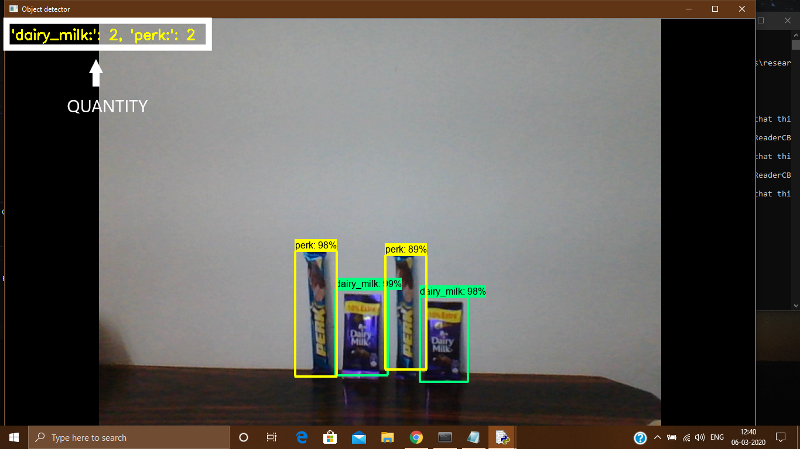

# -Smart-Retail-Shelves-Using-deep-learning-and-cv
TensorFlow’s Object Detection API have been used to detect the products that are kept on the shelves using cameras. We have used some pre-trained models (e.g. Faster_RCNN_Inception_V2 model) to train the classifier to classify different objects by using the dataset of images of different products. The training has been done until the loss consistently drops below 0.05 and which is around 40000 steps. 
## Modules
<ul>
<li><b>Dataset Preparation Module:</b> This module deals with collection of images which
constitutes of the dataset.</li>
<li><b>Training Preparation Module:</b> This module deals with preparing of the dataset for
training purposes which includes labelling of images and creating the label map.</li>
<li><b>Training and Testing the Classifier Module:</b> In this module, the actual training of
dataset begins and once the training is completed then the testing of classifier is
done.</li>
</ul>
<ul>
<li><h3>Dataset Preparation Module:</h3>
1. TensorFlow needs various pictures of an instance to put-in a highly accurate identifier
classifier. 
2. For a classifier to become strong training needs to be done. The pictures which are
trained will be having snaps of instances in the picture along with the wanted
instances, and thundering states should be there. 
3. The dataset that we have taken consists of two products. 
4. For our Product Identifier classifier, we will be having two varieties of Chocolates
(Dairy milk and Perk). We have taken about 150 pictures of each chocolate, and there
are many non-desired instances in the images. 
5. Then, we took about another 50 pictures with both chocolates in the picture. We want
to be able to detect the chocolates when they’re overlapping, so we made sure to have
the chocolates be overlapped in many images. 
6. Here are some examples of images containing chocolates: 
  

  

  

</li>

  
<li><h3>Training Preparation Module:</h3>
  1. LabelImg of the objects in the images is done so that classifier can identify objects
in the images. 
2. For labelling we have used LabelImg.  
  

3. An .XML file will be saved by labelimg that contains the data which is labelled i.e.
(the coordinates and dimensions) for every picture. 
4. These .xml files would be used to generate TFRecords. These are put-in to the TF. 
5. With the images labelled, now a csv file is generated from all the xml files. 
6. This file contains the coordinates of the target instances in every picture of the
dataset. 
7. In the Tfrecord file, an ID number is assigned for every instance. 
8. Now, label map file is created. 
9. A map with a label tells the trainer that each item is to specify a mapping of the
    class names to the class ID numbers. </li>
    <li><h3>Training and Testing the Classifier Module:</h3>
  In this module the actual training of the object detection classifier starts.
    

       

      Figure shows how the training of dataset is takin place. It depicts the steps and the loss
of the classifier. At each step loss is specified. It also depicts the time it takes to execute
each step and is specified in sec/steps (seconds per step). 
1. When the loss consistently drops below 0.05 till then the model is continuously
trained that is approximately 40000 steps. 
2. Once the training is complete, the last step is to generate the inference graph. 
3. Once the inference graph which is frozen, now it’s time to test the object detection
classifier. 
      </li>
  </ul>
##Results
During the training, the tensorboard shows various graphs which depicts various types of losses.
A Loss function is used to study how much the values that were predicted differ from the actual values of the training data. Hence the loss value should be low. Here the overall total loss is less than 0.05 and is almost constant. 

       

Once the training is complete and the inference graph is generated then the classifier is ready for testing. The classifier is trained to detect two chocolates namely “Dairy Milk” and “Perk”.

       

      

       

      

       

      
      
